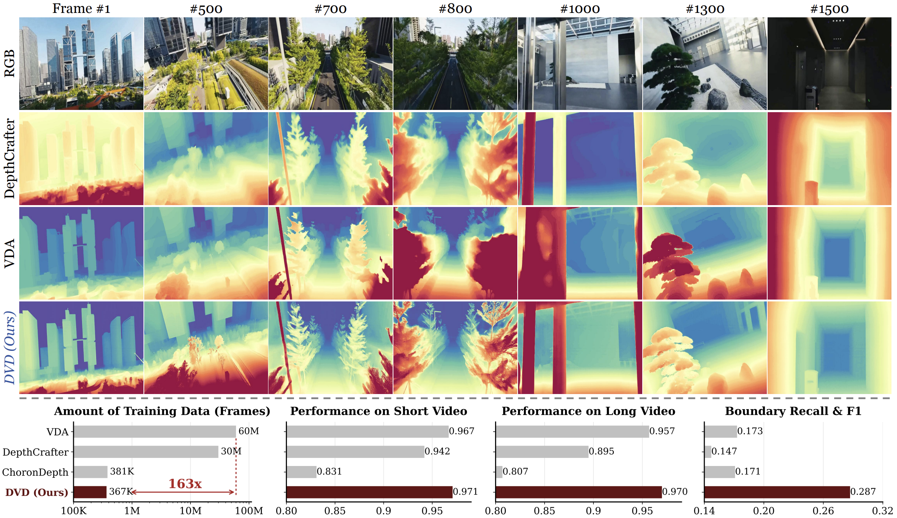

<h2 align="center"> DVD: Deterministic Video Depth Estimation with Generative Priors</h2>
<div align="center">

_**[Hongfei Zhang](https://soyouthinkyoucantell.github.io/)<sup>1*</sup>, [Harold H. Chen](https://haroldchen19.github.io/)<sup>1,2*</sup>, [Chenfei Liao](https://chenfei-liao.github.io/)<sup>1*</sup>, [Jing He](https://jingheya.github.io/)<sup>1*</sup>, [Zixin Zhang](https://scholar.google.com/citations?hl=en&user=BbZ0mwoAAAAJ)<sup>1</sup>, [Haodong Li](https://haodong2000.github.io/)<sup>3</sup>, [Yihao Liang](https://scholar.google.com/citations?user=rlKejNUAAAAJ&hl=en)<sup>4</sup>,
<br>
[Kanghao Chen](https://khao123.github.io/)<sup>1</sup>, [Bin Ren](https://amazingren.github.io/)<sup>5</sup>, [Xu Zheng](https://zhengxujosh.github.io/)<sup>1</sup>, [Shuai Yang](https://andysonys.github.io/)<sup>1</sup>, [Kun Zhou](https://redrock303.github.io/)<sup>6</sup>, [Yinchuan Li](https://scholar.google.com/citations?user=M6YfuCTSaKsC&hl=en)<sup>7</sup>, [Nicu Sebe](https://disi.unitn.it/~sebe/)<sup>8</sup>,
<br>
[Ying-Cong Chen](https://www.yingcong.me/)<sup>1,2†</sup>**_
<br><br>
<sup>*</sup>Equal Contribution; <sup>†</sup>Corresponding Author
<br>
<sup>1</sup>HKUST(GZ), <sup>2</sup>HKUST, <sup>3</sup>UCSD, <sup>4</sup>Princeton University, <sup>5</sup>MBZUAI, <sup>6</sup>SZU, <sup>7</sup>Knowin, <sup>8</sup>UniTrento

<h5 align="center"> If you like our project, please give us a star ⭐ on GitHub for latest update.  </h2>

 [](https://dvd-project.github.io/)
 [](https://arxiv.org/abs/2603.12250)
 [](https://huggingface.co/FayeHongfeiZhang/DVD/tree/main)
 [](https://huggingface.co/spaces/haodongli/DVD)
<br>

</div>




## 👋 Introduction

Welcome to the official repository for **DVD: Deterministic Video Depth**! 

While current video depth estimation methods face a strict *ambiguity-hallucination dilemma*—where *discriminative models* suffer from semantic ambiguity and poor open-world generalization, and *generative models* struggle with stochastic hallucinations and temporal flickering—**DVD** fundamentally breaks this trade-off. 

We present the first deterministic framework that elegantly adapts pre-trained Video Diffusion Models (like WanV2.1) into single-pass depth regressors.
By cleanly stripping away generative stochasticity, DVD unites the profound semantic priors of generative models with the structural stability of discriminative regressors.

### ✨ Key Highlights

* 🚀 **Extreme Data Efficiency:** DVD effectively unlocks profound generative priors using only **367K frames**—which is **163× less** task-specific training data than leading discriminative baselines like VDA (60M frames).
* ⏱️ **Deterministic & Fast:** Bypasses iterative ODE integration. Inference is performed in a single forward pass, ensuring absolute temporal stability without generative hallucinations.
* 📐 **Unparalleled Structural Fidelity:** Powered by our Latent Manifold Rectification (LMR), DVD achieves state-of-the-art high-frequency boundary precision (Boundary Recall & F1) compared to overly smoothed baselines.
* 🎥 **Long-Video Inference:** Equipped with our training-free *Global Affine Coherence* module, DVD seamlessly stitches sliding windows to support long-video rollouts with negligible scale drift.

> **TL;DR:** If you want state-of-the-art video depth estimation that is highly detailed, temporally stable across long videos, and exceptionally data-efficient, **DVD** is what you need.

---

## 📢 News
- **[2026.04.07]** 🔥 DVD v1.1 is out! It's now more robust to reflective surfaces and has better temporal consistency!
---

https://github.com/user-attachments/assets/2b69685a-b857-4f4a-a896-dafc6460542e

---
- **[2026.03.14]** 🤗 Hugging Face Gradio demos ([Online](https://huggingface.co/spaces/haodongli/DVD) and [Local](https://github.com/EnVision-Research/DVD?tab=readme-ov-file#-gradio-demo)) released.
- **[2026.03.13]** 📄 Paper is available on [arXiv](https://arxiv.org/abs/2603.12250).
- **[2026.03.12]** 🌐 [Project page](https://dvd-project.github.io/) is live.
- **[2026.03.11]** 🤗 Pre-trained weights released on [Hugging Face](https://huggingface.co/FayeHongfeiZhang/DVD/tree/main).
- **[2026.03.10]** 🔥 Repository initialized and training & inference code released.

### Community Work
- **[2026.03]** 🧩 [ComfyUI](https://github.com/spiritform/comfy-dvd) node for DVD is out. Shout out for the contributors! 

---

## 💿 Pre-trained Models

We provide the official pre-trained weights for **DVD**, designed for robust, zero-shot relative video depth estimation.

| Model Version | Backbone | Description | Download |
| :--- | :--- | :--- | :---: |
| **DVD v1.0** | Wan2.1 | Our default model achieving SoTA performance with unprecedented structural fidelity. | [🤗 Hugging Face](https://huggingface.co/FayeHongfeiZhang/DVD/tree/main) |
| **DVD v1.1** | Wan2.1 | Performance optimizations & refined temporal consistency. Robust to reflective surface! |[🤗 Hugging Face](https://huggingface.co/FayeHongfeiZhang/DVD/blob/main/dvd_1.1.safetensors) |

---

## 📂 Core Folders & Files Overview

To help you navigate the codebase quickly, we have divided the core directories into two main categories based on what you want to do: **Inference** (just using the model) or **Training** (fine-tuning or training from scratch).

### 🎬 For Inference (Testing & Using the Model)
If you just want to generate depth maps from your own videos or reproduce our paper's results, focus on these folders:

* **`infer_bash/` (The Launchpad):** Ready-to-use shell scripts (e.g., `openworld.sh`). This is the easiest way to run the model on your data without writing any code.
* **`ckpt/` (The Vault):** This is where you should place our pre-trained model weights downloaded from Huggingface.
* **`inference_results/` (The Output Bin):** Once you run an inference script, your generated depth maps and visualizer videos will appear here.
* **`demo/` :** Quick-start examples and sample inputs to help you verify that your environment is set up correctly.

### 🏋️‍♂️ For Training (Fine-tuning & Development)
If you want to train DVD on your own datasets or modify the architecture, these are your go-to folders:

* **`train_config/` (The Control Center):** YAML configuration files. You can easily tweak hyperparameters (like learning rate, batch size) and dataset paths here.
* **`train_script/` (The Engine):** Contains the training bash.
* **`diffsynth/pipelines/wan_video_new_determine.py` (The Brain):** The core DVD model architecture. If you want to understand or modify how we stripped away the generative noise to build the deterministic forward pass, look here.
* **`infer_bash/` & `test_script/` (The Evaluator):** Scripts used to evaluate your newly trained checkpoints against standard benchmarks during or after training.
* **`examples/dataset/`:** Codes of dataset construction.

---


## 🛠️ Installation

### 📦 Install from source code (Basic Dependency):


```
git clone https://github.com/EnVision-Research/DVD.git
cd DVD
conda create -n dvd python=3.10 -y 
conda activate dvd 
pip install -e .
```

### 🏃 Install SageAttention (For Speedup):
```
pip install sageattention # DO NOT USE THIS FOR TRAINING!!!
```
### 🤗 Download the checkpoint from Huggingface

#### 1. Login to huggingface
```
huggingface-cli login # Or hf auth login 
```
####  2. Download the checkpoint from [huggingface repo](https://huggingface.co/FayeHongfeiZhang/DVD/tree/main)

```
huggingface-cli download FayeHongfeiZhang/DVD --revision main --local-dir ckpt
```

#### 3. The final structure shoule be like
```
DVD
├── ckpt/
├──── model_config.yaml
├──── model.safetensors
├── configs/
├── examples/
├── ...
```

### 💅🏻 Potential Issue (from [DiffSynth Studio](https://github.com/modelscope/DiffSynth-Studio))

If you encounter issues during installation, it may be caused by the packages we depend on. Please refer to the documentation of the package that caused the problem.

* [torch](https://pytorch.org/get-started/locally/)
* [sentencepiece](https://github.com/google/sentencepiece)
* [cmake](https://cmake.org)
* [cupy](https://docs.cupy.dev/en/stable/install.html)

---

## 🤗 Gradio Demo

We provide an interactive Gradio interface for you to easily test DVD on your own videos without writing any code.

**1. Online Demo:** The easiest way to experience DVD! Try it out directly on our [Hugging Face](https://huggingface.co/spaces/haodongli/DVD).
> **⚠️ Note on Online Demo:** Due to GPU resource constraints on Hugging Face, the online web demo is currently limited to processing videos of up to **5 seconds**. To process longer videos, we highly recommend running the local deployment below!

**2. Local Deployment:**
If you prefer to run the UI locally, ensure your environment is set up and simply execute:
```bash
python test_script/app.py
```

---

## 🕹️ Inference

### 🤹🏼‍♂️ Quick Start with Demo Videos

```
bash infer_bash/openworld.sh
```

You may also put more videos in the `demo/` directory and alter the video path in the bash to get more results!

---


### 👩🏼‍🏫 For Academic Purpose (Paper Setting)


####  1. Video Inference

1.1. Download the [KITTI Dataset](https://www.cvlibs.net/datasets/kitti/), [Bonn Dataset](https://www.ipb.uni-bonn.de/data/rgbd-dynamic-dataset/index.html), [ScanNet Dataset](http://www.scan-net.org/).

1.2. Format the dataset as the structure below
```
kitti_depth
├── rgb
├──── 2011_09_26
├──── ...
├── depth
├──── train
├──── val

rgbd_bonn_dataset
├── rgbd_bonn_balloon
├── rgbd_bonn_balloon_tracking
├── ...

scannet
├── scene0000_00
├── scene0000_01
├── ...
```

1.3. Reconfig the bash (**$VIDEO_BASE_DATA_DIR**) and run the video inference script
```
bash infer_bash/video.sh
```

####  2. Image Inference

2.1. Download the [evaluation datasets](https://share.phys.ethz.ch/~pf/bingkedata/marigold/evaluation_dataset/) (depth) by the following commands (referred to [Marigold](https://github.com/prs-eth/Marigold)).

2.2.
Reconfig the bash (**$IMAGE_BASE_DATA_DIR**) and run the image inference script

```
bash infer_bash/image.sh
```

---


## 🔥Training 

#### Please refer to this [document](train_script/train.MD) for details on training.

---

## 📜 License

This project adopts a split-license strategy to comply with the licensing terms of our upstream datasets and foundation models:

* **Code:** The source code of DVD is released under the permissive [Apache 2.0 License](LICENSE).
* **Model Weights:** The pre-trained model weights are released under the [CC BY-NC 4.0 License](https://creativecommons.org/licenses/by-nc/4.0/), which strictly limits usage to non-commercial, academic, and research purposes.

By downloading or using the code and models, you agree to abide by these terms.


---


## 👏 Acknowledgement

We sincerely thank the authors of [Depth Anything](https://github.com/DepthAnything/Depth-Anything-V2) and [RollingDepth](https://github.com/prs-eth/RollingDepth) for providing their implementing details. We would also thanks the contributors of [DiffSynth](https://github.com/modelscope/DiffSynth-Studio) where we borrow codes from.


---

## 👾 Reference

If you find our work useful in your research, please consider citing:
```bib
@article{zhang2026dvd,
  title={DVD: Deterministic Video Depth Estimation with Generative Priors},
  author={Zhang, Hongfei and Chen, Harold Haodong and Liao, Chenfei and He, Jing and Zhang, Zixin and Li, Haodong and Liang, Yihao and Chen, Kanghao and Ren, Bin and Zheng, Xu and others},
  journal={arXiv preprint arXiv:2603.12250},
  year={2026}
}
```


